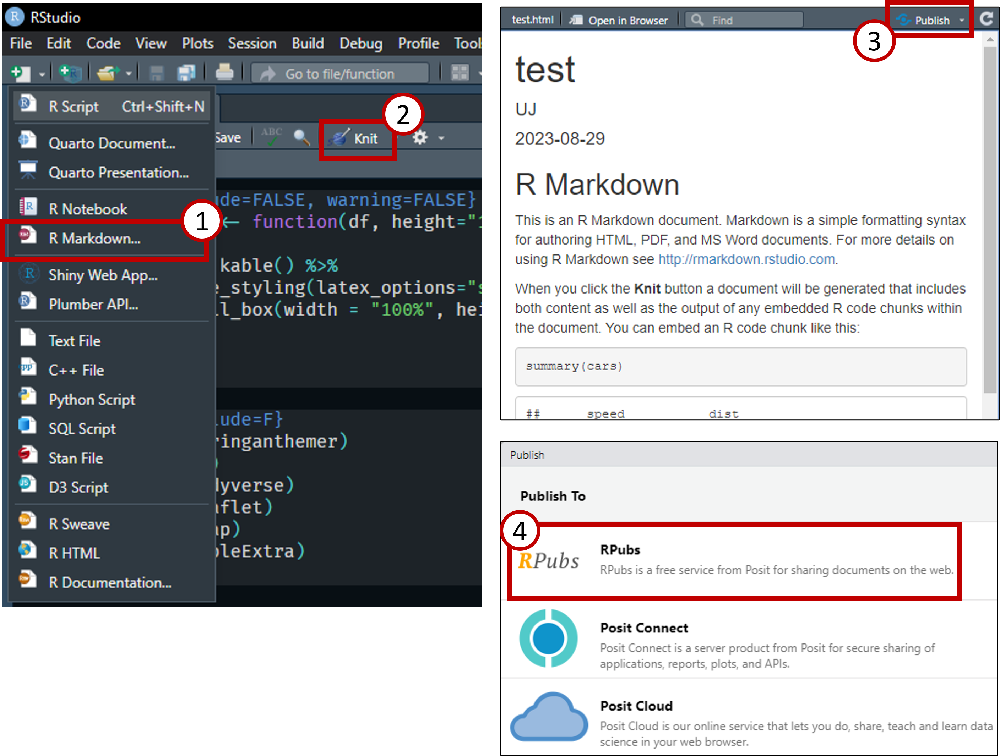
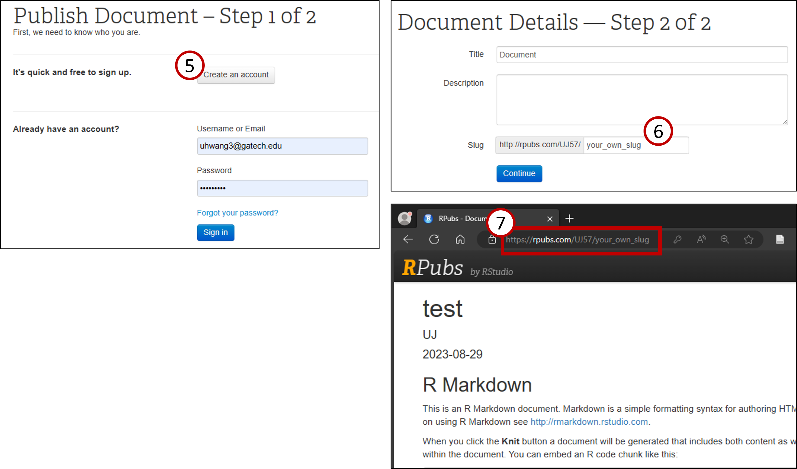
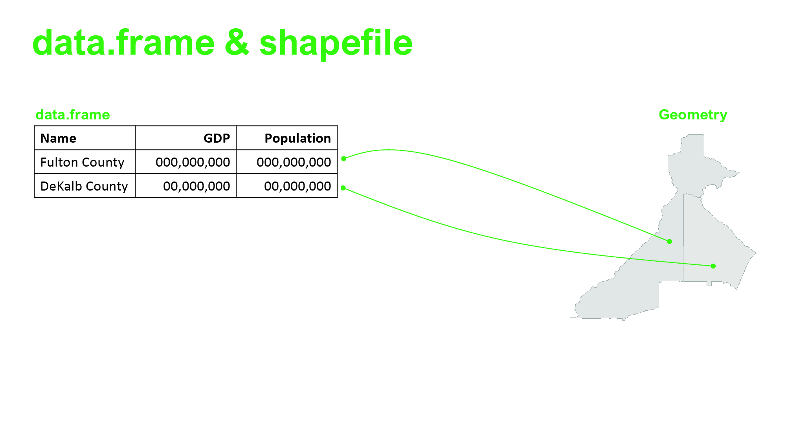
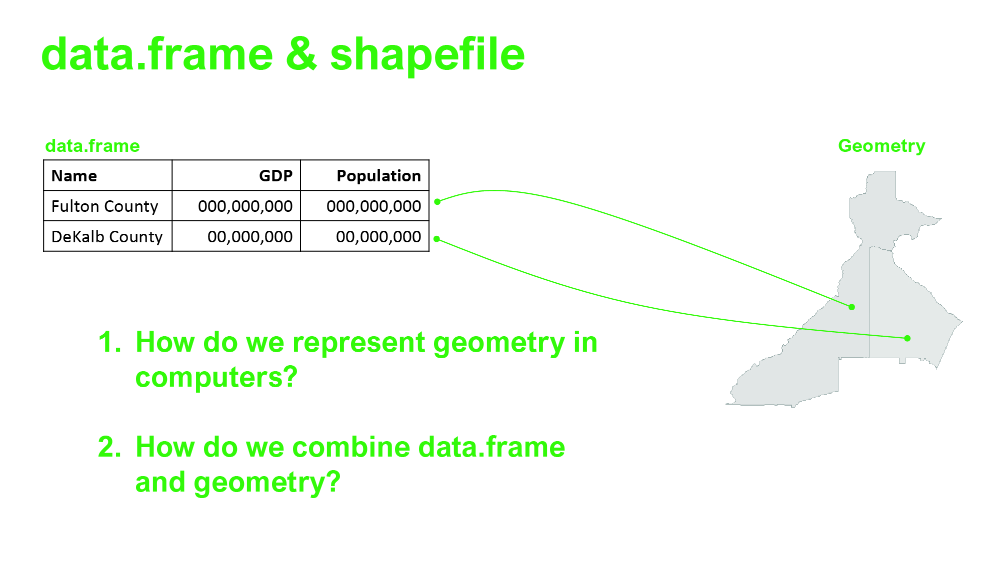
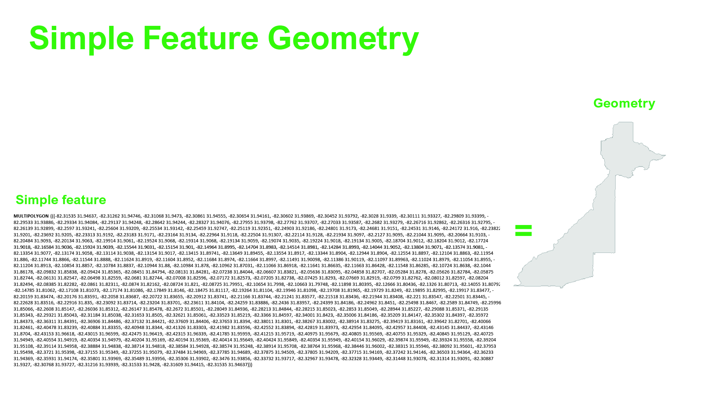
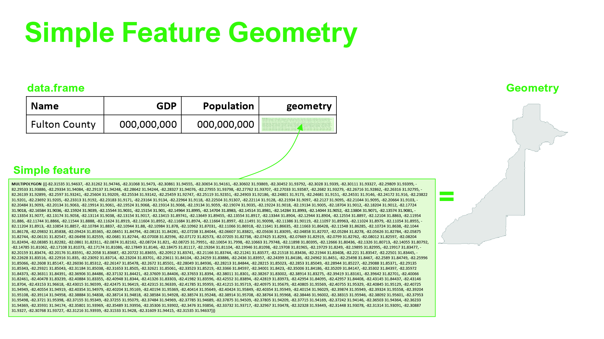
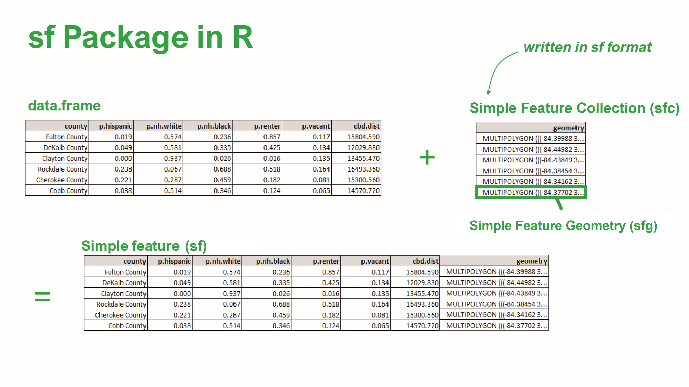
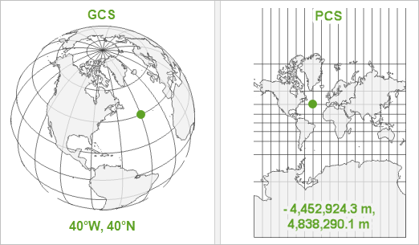
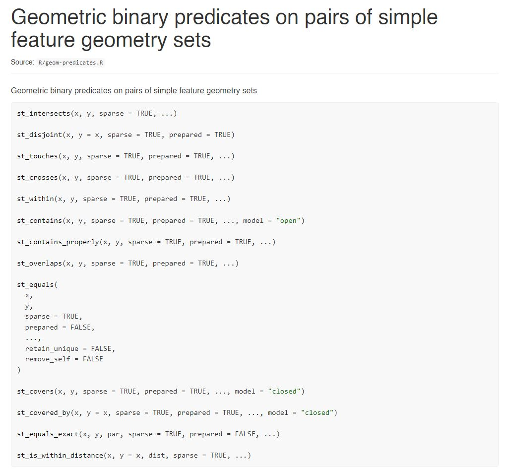
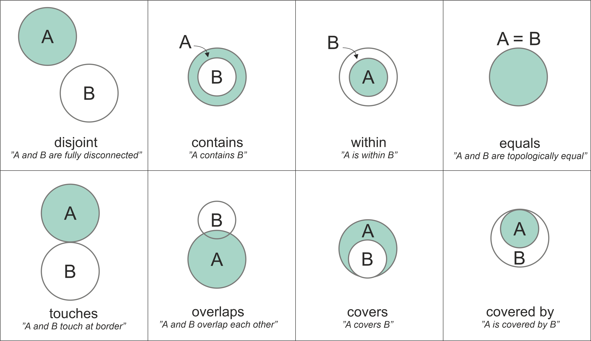

class: inverse, middle

# Intro to R - 2


.font100[
Uijeong "UJ" Hwang

8/26/2024
]
```{r setup, include=FALSE} 
knitr::opts_chunk$set(warning = FALSE) 
```

```{r include=FALSE, warning=FALSE}
nice_table <- function(df, height="150px"){
  return(
    df %>% kable() %>% 
      kable_styling(latex_options="scale_down", font_size=12) %>% 
      scroll_box(width = "100%", height = height)
    )
}
```

```{r, include=F}
library(xaringanthemer)
library(sf)
library(tidyverse)
library(leaflet)
library(tmap)
library(kableExtra)
library(tictoc)
```
---
## Content

* R Markdown & Rpubs
* Custom function
* Loops
* geospatial data in R

---
class: inverse, center, middle

# R Markdown & Rpubs

---
## R Markdown

* **R Markdown** is a markdown that contains chunks of embedded R code.
* **Markdown** is an easy-to-use simplified markup language.
* **Markup language** is a text-encoding system that specifies the structure and formatting of a document.
* **Markup language examples**: Markdown, HTML, and LaTeX.
* These presentation slides are made by R Markdown.
* [Our syllabus](https://ujhwang.github.io/urban-analytics-2024) is also an R Markdown document in which all tables are written in R code. <br>
* [A cooler example](http://timelyportfolio.github.io/rCharts_nyt_home_price/).
* To create an R Markdown file, go to **file > R Markdown.**

---
## Basics

* Hash tags for headings.
# # Heading 1 (h1)
## ## Heading 2 (h2)
* Nothing for plain text. End the line with two spaces at the end starts a new line.
* `Control + Alt + i` to create an R code chunk.
```{r}
0.1 + 0.2 == 0.3
```

---
## Basics

* Press Knit button or `Control + Alt + k` to render it as HTML (or other formats).

* Wrap text with \*\*[text]\*\* to make it bold, \*[text]\* to make it italic, or \*\*\*[text]\*\*\* for both.
* \[text\]\(url\) to make text a hyperlink.

* \!\[caption\]\(url or file\) to embed an image.

* Start a line with * or - to start a bulleted list and 1. for a numbered list.

* HTML tags work. E.g., `<br>` `<font>` etc. 

<br>

**Go to Help > Cheat Sheets > R Markdown Cheat Sheets** to see more options.

---
## Rpubs
RPubs is an open platform by R Studio (the company) for publishing R Markdown documents and presentations. 
* It's free. 
* Everything you upload there is open to public.
* **DO NOT** upload anything you need to protect (e.g., API keys, personal info etc.).

To create an account, [**click here**](https://rpubs.com/).

---
## Publishing on Rpubs

---
## Publishing on Rpubs



---
class: inverse, middle, center
# Custom Function

---
## Function
.small[
* We have learned functions provided by R as built-in functions or by someone else as a package.
  * sum(); dplyr::filter()
* Now we will learn how to define our own functions.
```{r eval=F}
functionName <- function(argument){
  something <- doSomething(argument)
  what_i_need <- doAnotherThing(something)
  return(what_i_need)
}
```
* Why custom functions?
  * Code reusability and maintainability
  > Rule of Three: If you're copying and pasting a block of code more than two times, it might be worth creating a function
  * Cleaner environment: function scope vs. global scope
]

---
## Function example
.small[
.pull-left[
* without a function
```{r eval=F}
summary1 <- df1 %>% 
  filter(a > 100) %>% 
  group_by(b) %>% 
  summarize(c = sum(c), 
            d = sum(d)) %>%
  mutate(e = round(c/d, 2))

summary2 <- df2 %>% 
  filter(a > 100) %>% 
  group_by(b) %>% 
  summarize(c = sum(c), 
            d = sum(d)) %>%
  mutate(e = round(c/d, 2))

summary3 <- df3 %>% 
  filter(a > 100) %>% 
  group_by(b) %>% 
  summarize(c = sum(c), 
            d = sum(d)) %>%
  mutate(e = round(c/d, 2))
```
]
]

---
## Function example
.small[
.pull-left[
* without a function
```{r eval=F}
summary1 <- df1 %>% 
  filter(a > 100) %>% 
  group_by(b) %>% 
  summarize(c = sum(c), 
            d = sum(d)) %>%
  mutate(e = round(c/d, 2))

summary2 <- df2 %>% 
  filter(a > 100) %>% 
  group_by(b) %>% 
  summarize(c = sum(c), 
            d = sum(d)) %>%
  mutate(e = round(c/d, 2))

summary3 <- df3 %>% 
  filter(a > 100) %>% 
  group_by(b) %>% 
  summarize(c = sum(c), 
            d = sum(d)) %>%
  mutate(e = round(c/d, 2))
```
]
.pull-right[
* with a function
```{r eval=F}
createSummary <- function(df){
  summary <- df %>% 
    filter(a > 100) %>% 
    group_by(b) %>% 
    summarize(c = sum(c), 
              d = sum(d)) %>%
    mutate(e = round(c/d, 2))
  return(summary)
}

summary1 <- createSummary(df1)
summary2 <- createSummary(df2)
summary3 <- createSummary(df3)
```
]
]

---
## Function example
.small[
.pull-left[
* without a function
```{r eval=F}
summary1 <- df1 %>% 
  filter(co_lumn > 100) %>% #<< 
  group_by(b) %>% 
  summarize(c = sum(c),
            d = sum(d)) %>%
  mutate(e = round(c/d, 2))

summary2 <- df2 %>% 
  filter(col_umn > 100) %>% #<<
  group_by(b) %>% 
  summarize(c = sum(c), 
            d = sum(d)) %>%
  mutate(e = round(c/d, 2))

summary3 <- df3 %>% 
  filter(colum_n > 100) %>% #<<
  group_by(b) %>% 
  summarize(c = sum(c), 
            d = sum(d)) %>%
  mutate(e = round(c/d, 2))
```
]
]

---
## Function example
.small[
.pull-left[
* without a function
```{r eval=F}
summary1 <- df1 %>% 
  filter(co_lumn > 100) %>% #<< 
  group_by(b) %>% 
  summarize(c = sum(c), 
            d = sum(d)) %>%
  mutate(e = round(c/d, 2))

summary2 <- df2 %>% 
  filter(col_umn > 100) %>% #<<
  group_by(b) %>% 
  summarize(c = sum(c),
            d = sum(d)) %>%
  mutate(e = round(c/d, 2))

summary3 <- df3 %>% 
  filter(colum_n > 100) %>% #<<
  group_by(b) %>% 
  summarize(c = sum(c), 
            d = sum(d)) %>%
  mutate(e = round(c/d, 2))
```
]
.pull-right[
* with a function
```{r eval=F}
createSummary <- function(df, a){
  summary <- df %>% 
    filter(a > 100) %>% 
    group_by(b) %>% 
    summarize(c = sum(c), 
              d = sum(d)) %>%
    mutate(e = round(c/d, 2))
  return(summary)
}

summary1 <- createSummary(df1, 'co_lumn')
summary2 <- createSummary(df2, 'col_umn')
summary3 <- createSummary(df3, 'colum_n')
```
* but, why quotation marks?
]
]

---
## More on indexing
.small[
```{r}
df <- data.frame(column1 = c(1,2,3,4), column2 = c('a','b','c','d'))
```

.pull-left[
```{r}
df$column1
```

```{r}
df$'column1'
```

```{r}
df[,'column1']
```

```{r}
df[['column1']]
```

```{r eval=F}
# not working
df[, column1]
df[[column1]]
```
]

.pull-right[
```{r}
df %>% select(column1)
```

```{r}
df %>% select('column1')
```
]
]


---
## Create a function: Timestamp Day Converter
***Create your own function that tells which day the given Unix time is.*** <br><br>

Unix time <font size="-1">(a.k.a Unix epoch, Unix timestamp, or POSIX time)</font> is the number of seconds that have elapsed since **midnight 01/01/1970 (Thursday)**. Assume that the time zone of the function user is GMT/UTC+0 (in other words, do not worry about the time zone).

* Test your function:
> Which day is Unix time **1693103227**?

.footnotesize[
*hint: modulus (`%%`) and integer division (`%/%`) will be useful.
<br><br>
<p style="color:#ffffff">
getDayFromTimestamp <- function(t){
  d <- 60*60*24
  day_index <- t%/%d%%7 + 1
  days <- c('Thurs','Fri','Satur','#Sun','Mon','Tues','Wednes')
  paste0('Unix Timestamp ', t, ' is [', days[day_index], 'day]')  
}
</p>
]


---
class: inverse, middle, center
# Loops

---
## For-Loops
* Loops are used to repeat a specific task. Ones that I commonly use include for-loop, while-loop, and apply.

**For-loop** iterates over a vector.
```{r}
for (i in 1:3){
  print(i + 2)
}
```

---
## For-Loops
* Loops are used to repeat a specific task. Ones that I commonly use include for-loop, while-loop, and apply.

**For-loop** iterates over a vector.

.pull-left[
```{r}
abcde <- letters[1:5]
for (letter in abcde){
  print(letter)
}
```
]
.pull-right[
```{r}
abcde <- letters[1:5]
for (i in 1:length(abcde)){
  print(abcde[i])
}
```
]

---
## For-loop example
.footnotesize[
```{r}
my_df <- read_csv("https://raw.githubusercontent.com/ujhwang/urban-analytics-2024/main/Lab/module_0/testdata.csv")

for (i in 1:10){
  # Extract row by row
  row <- my_df[i,]
  # If Clayton County, print income
  if (row$county == "Clayton County") print(paste0(row$county,"'s income is: ", row$hhincome))
  # If Cobb County, print population
  else if (row$county == "Cobb County") print(paste0(row$county,"'s population is: ", row$race.tot))
}
```
]
---
## While-Loop

.footnotesize[
**A while loop** keeps repeating the task as long as a specified condition is true.
```{r}
# this is condition that's 
# being check each iteration
n <- 1
v <- 1
while (v < 1000){ 
  # if (n >= 0), it will run forever
  print(paste0(n, "th iteration -- ,v is ", v))
  v <- v*2
  n <- n+1
}
print(v)
```


This is useful when you do not know exactly how many iteration is needed ahead of time. 

For example, you'd want to keep calculating some stuff (e.g., stochastic gradient descent) until the output converges to a pre-defined value.
]


---
## Apply

Another way to perform a similar task is to use apply family or its variants. The most commonly used ones would be `apply`, `sapply`, and `lapply`.

`sapply` and `lapply` are the same except that one returns a vector and the other returns a list.
```{r}
add_one <- function(x) x+1
sapply(1:3, add_one)
```

```{r}
lapply(1:3, add_one)
```

---
## Apply 
`apply` takes matrix or data.frame and returns a list. Because matrix and data.frame has two dimensions, apply takes an additional argument that specifies the dimension to which the function should be applied.
.pull-left[
```{r}
# Example matrix
mat <- matrix(c(rep(1,3),
                rep(2,3), 
                rep(3,3)), 
              nrow=3)
print(mat)
```
]

.pull-right[
```{r}
# Apply function over rows
print(apply(mat, 1, mean))

# Apply function over columns
print(apply(mat, 2, mean))
```
]

---
## For-loop vs. Apply
***Which one is faster?***
```{r eval=F}
vec <- 1:500000

# Using for-loop
result_forloop <- numeric(length(vec))

system.time({
  for(i in vec) {
    result_forloop[i] <- factorial(i)
  }
})

# Using sapply
system.time({
  result_sapply <- sapply(vec, function(x) factorial(x))
})
```

---
## For-loop vs. Apply
***How about this case?***
```{r eval=F}
# Generating a large matrix of random letters
mat <- matrix(sample(letters, 10^7, replace = TRUE), nrow = 100, ncol = 100000)

# Concatenate strings across each ROW
system.time({
  result_for <- character(nrow(mat))
  for (i in 1:nrow(mat)) {
    result_for[i] <- paste(mat[i, ], collapse = "")
  }
})

system.time({
  result_apply <- apply(mat, 1, paste, collapse = "")
})

```

---
## For-loop vs. Apply
***How about THIS case?***
```{r eval=F}
# Generating a large matrix of random letters
mat <- matrix(sample(letters, 10^7, replace = TRUE), nrow = 100, ncol = 100000)

# Concatenate strings across each COLUMN
system.time({
  result_for <- character(nrow(mat))
  for (i in 1:nrow(mat)) {
    result_for[i] <- paste(mat[, i], collapse = "") #<<
  }
})

system.time({
  result_apply <- apply(mat, 2, paste, collapse = "") #<<
})

```

---
## For-loop vs. Apply
***Does Apply involve parallelization?***
```{r eval=F}
vec <- 1:100

# Using for-loop
system.time({
  for(i in vec) {
    Sys.sleep(0.01)
  }
})

# Using sapply
system.time({
  sapply(vec, function(x) Sys.sleep(0.01))
})

```

---
## Parallelization
```{r eval=F}
vec <- 1:100

# Using sapply with parallelization
library(parallel)
cl <- makeCluster(2)

system.time({
  parSapply(cl, vec, function(x) Sys.sleep(0.01))
})
stopCluster(cl)

cl <- makeCluster(4)

system.time({
  parSapply(cl, vec, function(x) Sys.sleep(0.01))
})
stopCluster(cl)
```

---
## Pre-allocation
```{r eval=F}
n <- 20000

# Adding rows to an empty dataframe
df <- data.frame()

system.time({
  for (i in 1:n) {
    df <- rbind(df, data.frame(x = i, y = i^2))
  }
})

# Pre-allocating dataframe and then adding values
df <- data.frame(x = numeric(n), y = numeric(n))

system.time({
  for (i in 1:n) {
    df[i, ] <- c(i, i^2)
  }
})
```

---
## Pre-allocation
```{r eval=F}
n <- 20000

# Adding rows to an empty dataframe
df <- data.frame()

tic()
for (i in 1:n) {
  df <- rbind(df, data.frame(x = i, y = i^2))
  if (!i%%4000) { # same as `if (i%%4000 == 0) {`
    toc();tic() # semicolon tells where one command ends and another begins
  }
}

# Pre-allocating dataframe and then adding values
df <- data.frame(x = numeric(n), y = numeric(n))

tic()
for (i in 1:n) {
  df[i, ] <- c(i, i^2)
  if (!i%%4000){
    toc();tic()
  }
}

```


---
## Let's practice loops
***We want to recursively multiply a certain value by 3 until it gets greater than 1,000,000. How many times do we need to do that for each of the following prime numbers?***

```{r eval=F}
prime_vec <- c(2, 3, 5, 7, 11, 13, 17, 19, 23, 29)
```
<!--
prime_vec <- c(2, 3, 5, 7, 11, 13, 17, 19, 23, 29)
n_vec <- numeric(length = length(prime_vec))

for (i in 1:length(prime_vec)){
  p <- prime_vec[i]
  n <- 0
  while (p <= 1000000){
    p <- p*3
    n <- n+1
  }
  n_vec[i] <- n
}
-->


.footnotesize[
*hint: use both for-loop and while-loop.
]

---
class: inverse, middle, center

# Geospatial data in R

---

class: center, middle

---
class: center, middle


---
class: center, middle

---

.font180[.green[sf package in R]]

The **sf** stands for simple features. 

**"Simple features are a standardized way of encoding spatial vector data (points, lines, polygons) in computers" (Pebesma, 2018, 439).**

.font80[
* *Feature* can be thought of as "things" or objects that have a spatial location or extent (e.g., building or political state).
* *Feature geometry* refer to the spatial properties (location or extent) of a feature.
* *Feature attributes* refer to other properties that features have, such as name, some measured quantity, etc.
]


.footnote[
This content is adopted from Pedesma (2018) [Read](https://journal.r-project.org/archive/2018/RJ-2018-009/RJ-2018-009.pdf)
]

---
class: center, middle


---
## Polygon & Multipolygon

.small[
.pull-left[
```{r results='hide', message=F, out.width="100%"}
atlanta <- tigris::places('GA') %>% 
  filter(NAME == 'Atlanta')
ggplot(atlanta) + geom_sf()
```
]
.pull-right[
.scroll-box-12[
```{r out.width = "100%"}
# multipolygon
head(atlanta)
```
]
.scroll-box-12[
```{r out.width = "100%"}
# polygon
atlanta_polygon <- atlanta %>% 
  st_cast('POLYGON')
head(atlanta_polygon)
```
]
]
]
---
class: center, middle


---
class: center, middle


---
class: center, middle

---

* Fast reading and writing of data (but not necessarily plotting)
* sf objects can be treated as data.frames
* Works smoothly with dplyr verbs as well as `%>%`.


.footnote[image source: https://r-spatial.github.io/sf/articles/sf1.html]

---
## Import sf data to play with

```{r, eval=F}
library(sf)
census <- st_read("https://raw.githubusercontent.com/ujhwang/urban-analytics-2024/main/Lab/module_0/testdata.geojson")
marta <- st_read("https://raw.githubusercontent.com/ujhwang/urban-analytics-2024/main/Lab/module_0/MARTA_Routes.geojson")
five_point <- st_read("https://raw.githubusercontent.com/ujhwang/urban-analytics-2024/main/Lab/module_0/five_point.geojson") 
```

```{r message=F, include=F}
census <- sf::st_read("https://raw.githubusercontent.com/ujhwang/urban-analytics-2024/main/Lab/module_0/testdata.geojson") 
marta <- sf::st_read("https://raw.githubusercontent.com/ujhwang/urban-analytics-2024/main/Lab/module_0/MARTA_Routes.geojson") 
five_point <- sf::st_read("https://raw.githubusercontent.com/ujhwang/urban-analytics-2024/main/Lab/module_0/five_point.geojson") %>% st_set_crs(4326)
```

.footnotesize[.scroll-box-18[
```{r}
census %>% print()
```
]]
---
## What's inside geometry column
.footnotesize[
.scroll-box-10[
```{r}
census %>% st_geometry() # which is same as census$geometry
```
]
]
.scroll-box-10[.footnotesize[
```{r}
census %>% st_coordinates()
```
]]

---
## CRS: Coordinate reference system
.small[
The way in which spatial data that represent the earth's surface are drawn on a two-dimensional surface.
]
.font75[
* Two types of CRS:
  * Geographic coordinate system (GCS): angular units (lon/lat)
  * Projected coordinate system (PCS): linear units (meter or foot)
* CRS you will use in this class:
  * GCS: EPSG 4326 (WGS 84); EPSG 4269 (NAD 83)
  * PCS: EPSG 32616 (WGS 84/[UTM zone 16N](https://upload.wikimedia.org/wikipedia/commons/8/8d/Utm-zones-USA.svg));  EPSG 26967 (NAD 83/[Georgia West](https://geodesy.noaa.gov/SPCS/images/spcs83_conus_final.png))  
]



---
## Projection
Changing from one coordinate system to another.

.small[
.scroll-box-12[
```{r}
census %>% st_crs()
```
]
.scroll-box-12[
```{r}
census %>% st_transform(32616) %>% st_crs()
```
]
]

---
## Projection
See how the geometric unit changes after projection.

.small[
.scroll-box-12[
```{r}
census %>% st_geometry()
```
]
.scroll-box-12[
```{r}
census %>% st_transform(32616) %>% st_geometry()
```
]
]

---
## Static Mapping
.pull-left[
```{r}
# using plot (base r function)
plot(census$geometry)
```
]
.pull-right[
```{r}
# using ggplot2 (tidyverse)
library(tidyverse)
ggplot(census) + 
  geom_sf(aes(fill = census$hhincome))
```
]

---
## Interactive Mapping - tmap package
.pull-left[
```{r, out.width="100%", out.height="300px"}
library(tmap)
tm_shape(census) + 
  tm_polygons(col="hhincome")
```
]
.pull-right[
```{r, out.width="100%", out.height="300px"}
tmap_mode('view') # or use ttm()
tm_shape(census) + 
  tm_polygons(col="hhincome")
```
]
.font70[
* point: `tm_dots()`; line: `tm_lines()`; polygon: `tm_polygons()` or `tm_borders()`
]

---
## Data manipulation

.font90[
#### sf objects ARE data frames. .font60[.gray[(Note that sfc, sfg, etc. are not dataframes.)]]
Most verbs from dplyr packages work with sf objects. 

.scroll-box-18[
```{r, out.width="100%"}
census_group <- census %>% 
  select(county, hhincome) %>% 
  filter(county %in% c("Clayton County", "Fulton County")) %>% 
  group_by(county) %>% 
  summarize(count = n(),
            med.income = median(hhincome, na.rm = TRUE))
census_group
```
]]

---
## Data manipulation
The `group_by()` + `summarize()` combination modifies the geometry too. 
```{r out.width="100%"}
tm_shape(census_group) + tm_polygons(col = "med.income")
```

---
## Data manipulation
Keep in mind that `group_by()` + `summarize()` on sf data is geospatial computation.
```{r eval=F}
system.time(
  census %>% 
    group_by(county) %>% 
    summarize(med.income = median(hhincome, na.rm = TRUE)) %>% 
    print()
)

system.time(
  census %>%
    st_set_geometry(NULL) %>% #<<
    group_by(county) %>% 
    summarize(med.income = median(hhincome, na.rm = TRUE)) %>% 
    print()
)
```


---
## Subsetting by location

When you have two or more sf objects, you can select a subset. Let's do a demo with Census Tracts and a 10-KM buffer from the Five Points Station.


.pull-left[
.footnotesize[
```{r eval=F}
# Visualization
leaflet() %>% 
  addProviderTiles(providers$CartoDB.Positron) %>% 
  addPolygons(data = census, weight=1, color="grey") %>% #<<
  addPolygons(data = five_point, weight=1) %>% #<<
  addLegend("bottomright", 
            colors = c("blue", "grey"), 
            labels = c("five_point", 
                       "poly"), 
            title="Legend")
```
It's okay if you don't understand this code. We will learn about **leaflet** package later. 
]]

.pull-right[
.script-size[
```{r echo=F, message=F, warning=F}
fp.buffer <- suppressWarnings(five_point %>% st_buffer(dist = 10000)) 
# Visualization
leaflet(height=330, width="100%") %>% 
  addProviderTiles(providers$CartoDB.Positron) %>% 
  addPolygons(data = census, weight=1, color="grey") %>% 
  addPolygons(data = fp.buffer, weight=1) %>% 
  addLegend("bottomright", 
            colors = c("blue", "grey"), 
            labels = c("five_point", 
                       "poly"), 
            title="Legend")
```
]]
---
## Subsetting
The magic syntax is: 

.center[.red[sf-obj-1][.blue[sf-obj-2], , .green[operation]]]

.small[
```{r}
# Subsetting
census.subset <- census[five_point, , op = st_within] 
```
]

.scriptsize[
```{r, out.width="100%", out.height="300px"}
# Visualization
tm_shape(census.subset) + tm_polygons() +
  tm_shape(five_point) + tm_borders(col = "blue")
```
]

---
## Subsetting
The magic syntax is: 

.center[.red[sf-obj-1][.blue[sf-obj-2], , .green[operation]]]

.small[
```{r}
# Subsetting
census.subset2 <- census[five_point, ] # by default, op = st_intersects
```
]

.scriptsize[
```{r, out.width="100%", out.height="300px"}
# Visualization
tm_shape(census.subset2) + tm_polygons() +
  tm_shape(five_point) + tm_borders(col = "blue")
```
]

---
## Predicates
.font80[
In GIS, "**predicates are Boolean functions** that return TRUE if a comparison meets the functions criteria; otherwise, they return FALSE (f), to determine if a specific relationship exists between a pair of geometries." ([ESRI](https://help.arcgis.com/en/geodatabase/10.0/sdk/arcsde/concepts/geometry/shapes/spatial_relations/predicates.htm)).

Try `?st_intersects` in your console.
]


 
---

.footnotesize[
```{r}
pred_within <- census[five_point, , op = st_within]
pred_disjoint <- census[five_point, , op = st_disjoint]
pred_is_within_distance <- census[five_point, , op = st_is_within_distance,dist=10000]
```

```{r}
a <- leaflet() %>% 
  addProviderTiles(providers$CartoDB.Positron) %>% 
  addPolygons(data = pred_is_within_distance, weight=1,color="grey") %>% 
  addPolygons(data = five_point, color="black") %>% 
  addControl(html="<b>st_is_with_distance (10k)</b>", "topright")

b <- leaflet() %>% 
  addProviderTiles(providers$CartoDB.Positron) %>% 
  addPolygons(data = pred_disjoint, weight=1,color="grey") %>% 
  addPolygons(data = five_point, color="black") %>% 
  addControl(html="<b>st_disjoint</b>", "topright")

leafsync::sync(a,b)
```
]

---
## Predicates

```{r, echo=F}

```

---

## Buffer, intersection, etc.
Usual GIS operations work the same way in R as they do in ArcMap, for example.

.footnotesize[
```{r, out.width="100%", out.height="300px"}
# Buffer (5K) + intersection
buf <- marta %>% st_buffer(dist = units::set_units(5000, "m"))
buf_int_census <- buf %>% st_intersection(census)

tm_shape(census) + tm_polygons(col = "gray") + 
  tm_shape(buf_int_census) + tm_polygons(col = "red") +
  tm_shape(marta) + tm_lines(col = "blue", lwd = 3)
```
]

---
## Let's practice

.font80[
1. **Calculate the average household income of Census Tracts within 2 miles (or 3,219 meters) of the MARTA rail network in Fulton and DeKalb.**
2. **Calculate the average household income of Census Tracts whose** ***centroids*** **are within 2 miles of the MARTA rail network in Fulton and DeKalb.**
3. **Using the method from 2., compare the average household income of Census Tracts within 2 miles of the MARTA rail network to those beyond 2 miles in Fulton and DeKalb counties.**
4. **Compare the average household income of Census Tracts within 2 miles of RED lines to those within 2 miles of BLUE lines in Fulton and DeKalb counties. Ignore Census Tracts within 2 miles of both RED and BLUE lines.**
]
  
.font70[
* Data provided:
  - `census`: Census Tracts (polygon) in three counties (Fulton, DeKalb, and Cobb).
  - `marta`: three lines (Red, Gold, and Blue) of the Marta rail system.
* Packages required: `tidyverse`, `sf`, and `tmap`.
* Functions/operators you may find useful: `head()`, `st_buffer()`, `mean(x, na.rm = T)`, `st_centroid()`, `st_within()`, `filter()`, `str_detect()`, `st_set_geometry(NULL)`, `%in%`
]

---
class: inverse, center, middle

#If we have time left..

---
## Spatial join
.footnotesize[
Spatial join is incredibly useful tool that allows you to join two or more datasets based on geographic proximity that are otherwise disconnected. 

Two most important things to remember is that:

- The order in which you supply sf objects matters. If you do `st_join(A, B)`, A will the output with added information from B. If you do `st_join(B,A)`, B will be the output with information from A attached to it.

- The two (or more) sf objects should share the same CRS. 

```{r out.height='150px'}
# Join marta + census
m_j_c <- marta %>% st_join(census, st_intersects)
mjc_map <- tm_shape(m_j_c) + tm_lines(col = "hhincome")

# Join census + marta
c_j_m <- census %>% st_join(marta, st_intersects)
cjm_map <- tm_shape(c_j_m) + tm_polygons(col = "hhincome")

tmap_arrange(mjc_map, cjm_map, sync = T)
```
]
---

.footnotesize[
```{r}
# This is LINESTRING of marta lines
m_j_c %>% nice_table()

# This is POLYGON of census tracts
c_j_m %>% nice_table()
```
]

---
## Visualizing linestring and points
Let's visualize the first LINESTRING (i.e., Blue Line of MARTA) and the points that makes the LINESTRING.


.pull-left[
#### Extracting points
.scroll-box-20[
.footnotesize[
```{r}
marta.point <- marta %>% 
  # Extract the first row
  slice(2) %>% 
  # Turn it into coordinates
  st_coordinates() %>% 
  # Turn it into df
  as.data.frame() %>% 
  # df to sf
  st_as_sf(coords = c("X", "Y"), 
           crs = 4326)

marta.point
```
]
]
]

.pull-right[
#### Extracing line
.scroll-box-20[
.footnotesize[
```{r}
marta.line <- marta %>% 
  # Extract the first row
  slice(2) 

marta.line
```
]
]
]
---
## Plotting them together

.small[
```{r, out.width="100%"}
library(leaflet)
marta.point2 <- marta.point %>% group_by(L1) %>% slice(1)
pal <- colorNumeric(palette = "Reds", domain = marta.point2$L1)

leaflet() %>% 
  addProviderTiles(providers$CartoDB.Positron) %>% # Background map
  addPolylines(data = marta %>% slice(c(1,3)), 
               color="grey", weight=1) %>% # Adding non-Blue lines
  addPolylines(data = marta.line) %>% # Adding marta.line #<<
  addCircles(data = marta.point2, fillColor = ~pal(L1), fillOpacity=0.9, 
             stroke = F, radius = 500,
             popup=paste0("Row ID: ", marta.point2$L1)) # Adding marta.point #<<
```
]

---
## Why this is useful
Being able to parse the geometry at point level allows us to do any manipulation we want to do. 

For example, we want to cut the line into two at near Five Points Station (33.7539, -84.3916).
.footnotesize[
.scroll-box-14[
```{r}
# Creating POINT feature for five point station
five_point_station <- st_point(c(-84.3916, 33.7539)) %>% st_sfc(crs = 4326)

# Calculate pairwise distance to all points that define Gold line
dist.mat <- marta.point %>% st_distance(five_point_station)

# Which row contains the closest point?
closest.pnt <- which.min(dist.mat)

# Parse marta.line and create a cut-off line
marta.line.cut <- marta.line %>% 
  st_coordinates() %>% as.data.frame() %>% 
  mutate(break.point = c(rep("South",closest.pnt), rep("North",nrow(.)-closest.pnt))) %>% 
  st_as_sf(coords=c("X", "Y"), crs = 4326) %>% 
  group_by(break.point, L1) %>% summarize(do_union=FALSE) %>% st_cast("LINESTRING") %>% 
  group_by(break.point) %>% summarize(do_union=FALSE) %>% st_cast("MULTILINESTRING")

marta.line.cut
```
]
]

.center[
### No need to understand this code! I just wanted to demonstrate what can be done.
]
---
.scriptsize[
```{r, out.width="100%"}
pal <- colorFactor(palette = c("red", "blue"), domain = marta.line.cut$break.point)
  
leaflet() %>% 
  addProviderTiles(providers$CartoDB.Positron) %>% 
  addPolylines(data = marta.line.cut, color = ~pal(break.point)) %>% 
  addPolylines(data = marta %>% slice(1,3), color="grey", weight=1) %>% 
  addCircles(data=five_point_station, color="black", radius=300) %>% 
  addLegend("bottomright", pal = pal, values = marta.line.cut$break.point)
```
]