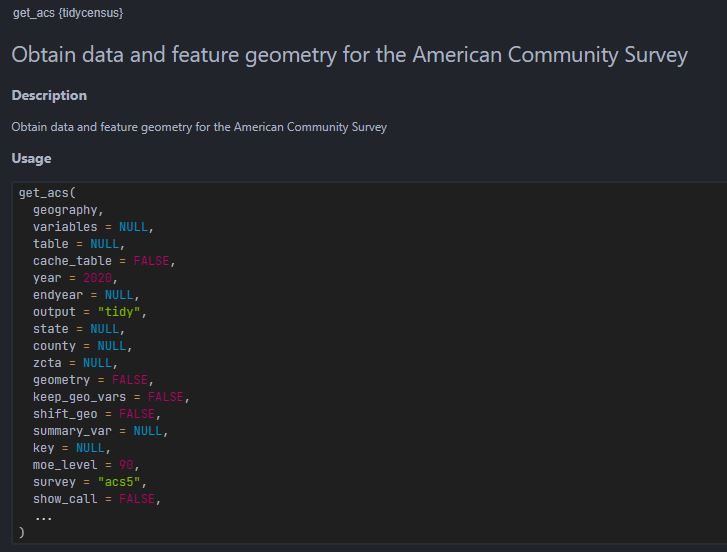

```{r setup, include=FALSE}
knitr::opts_chunk$set(echo = TRUE)
```

<style type="text/css">
  body{
  font-family: Arial;
  }
</style>

# New functions introduced in this document

Function                Description
---------------------   ---------------
tidycensus::get_acs     Downloads ACS data
sf::st_bbox             Get the bounding box 
sf::st_point            Create POINT simple feature geometry
sf::st_centroid         Get the centroid of a geometry
sf::st_distance         Calculate Euclidian distance between pairs of geometries
sf::st_geometry         Get geometry from an sf object
sf::st_transform        Transform coordinates of sf object
sf::st_coordinates      Get coordinates in matrix form
sf::st_set_geometry     Set geometry of an sf object
sf::st_as_sf            Convert foreign object to an sf object
sf::st_join             Spatial join
sapply                  Apply a function over a list or vector
min                     Return the minima of the input values
max                     Return the minima of the input values
abs                     Return absolute valueof the input value
seq                     Generate a regular sequences
expand.grid             Create a data.frame from all combinations of supplied vectors or factors.
names                   Get (or set) the names of an object
paste0                  Concatenate vectors after converting to character
ceiling                 Returns a numeric vector containing the smallest integers not less than x
bind_rows               Binding rows of data.frames into one.
Sys.getenv              Access the values of the environment variables              
list.files              Returns a character vector of the names of files or folder in the named folder.
units::set_units        Creates object of class units 
osmdata::getbb          Uses the free Nominatim API provided by OpenStreetMap to find the bounding box (bb) associated with place names.
yelpr::business_search  Search bussiness on Yelp using Yelp Fusion API's business search endpoint
jsonlite::flatten       Flattens nested data frame (i.e., data frames with one or more columns consisting of another data frame)
purrr::map_lgl          Funtional that returns a logical vector


# Getting data through API
In this document, we will use API (application programming interface) to acquire data from the Census Bureau & from Yelp Fusion API. According to Wiki, "An API is a way for two or more computer programs to communicate with each other." To use API, we generally need to connect to the endpoint of API server, which often looks something like `https://api.yelp.com/v3`. We then append other parameters to complete it. 

For example, the following is requesting **business search** service using a keyword **delis** for the location latitude of 37.787 and longitude of -122.399.

> `https://api.yelp.com/v3/businesses/search?term=delis&latitude=37.786882&longitude=-122.399972`

In our everyday terms, think of this as a data request application form. Once this 'form' is created, we need to send this 'form' to the server (i.e., the data provider). We would use e.g., `GET()` function in **httr package** to send API request to the server, and the server would return something like the following to the authenticated requests.


This JSON format can be reformatted into a data.frame format using e.g., **jsonlite** and **reshape2** packages. 


# Understanding Yelp Business Search
All APIs are different. Being familiar with Yelp Fusion API does not tell you anything about how Google Street View API is structured. So the first thing you need to do is to [**READ THE DOCUMENTATION OF YELP FUSION API**](https://docs.developer.yelp.com/docs/fusion-intro).

Yelp Fusion API has various endpoints: Business Search, Phone Search, Transaction Search, Business Details etc. You will notice that for everyting except **Business Search**, you need to have some information about the business you are looking for (e.g., business id, phone number, exact location, etc). Business Search allows us to search business by keywords (e.g., Ray's), catergories (e.g., cafe), location (e.g., coordinates), etc. **This is what we need.** Let's look at the related parameters of [Business Search](https://docs.developer.yelp.com/reference/v3_business_search).

1. The Business Search takes various input parameters, some optional and others required. Most importantly, we need to provide **geographic information** in which we want to do a search. We can provide it through one of the following ways: 

  * `location` parameter: E.g., New York City, NYC, 350 5th Ave, etc.
  * `longitude and latitude` parameter: E.g., 33.7484, -84.3902.
  * `radius` parameter: Search radius. Note that the actual search radius may vary. Max 40,000 meters.

2. Other important parameters are `limit` and `offset`.

  * `limit` parameter: Number of business results to return. For results of more than 50 businesses, Yelp returns results in **multiple pages**. The `limit` parameter determines how many businesses are contained in one page.
  * `offset` parameter: This parameter defines the amount by which the returned results are offset. For example, with `limit` of 50, the first request will give us 50 businesses. To get 51th ~ 100th business, we should set `limit = 50`.

An important limitation of the Business Search in Yelp Fusion API is that **it returns up to 1,000 businesses based on the provided search criteria**. It means if you request Yelp to return all restaurants in Decatur using one search criteria, you may not get all the restaurants in Decatur if there are more than 1000 of them in Decatur. **You would need to break your search into smaller bits to ensure that you get less than 1000 hits for each search criteria**.


> **There is [Yelp Open Dataset](https://www.yelp.com/dataset). Why not use this instead?** <br> It is a subset of the businesses, reviews, and user data for use in personal, educational, and academic purposes, containing 6,990,280 reviews and 150,346 businesses from 11 metropolitan areas. <br><br> However, I do not know whether this data is a sample or not. If it is a sample, we would need to know the sampling method, when the sampling was done, when the update will be made, etc. In other words, we don't have information on velocity and exhaustivity of the data. Without these information, we cannot assess whether findings from this dataset is biased or not.


# Downloading Census Track Polygons through Census API
In this document, we will use Census Tract boundary as a device to break down the city of Decatur into smaller bits so that one search criteria would not generate more than 1000 hits. Census Tract is useful for this purpose because, by definition, the size of Census Tracts is proportional to the population size. Assuming that there are more POIs in more populous area, we can *roughly* expect that the size of Census Tracts would be proportional to the POI numbers. 

The Census bureau provides API. There is a convenient R package that makes accessing Census API easy, called *tidycensus*. The package has **get_acs()** function that can download American Community Service (ACS) directly into your R session as an sf object.

## Census API Key
First of all, we need to acquire Census API Key. Go to [https://api.census.gov/data/key_signup.html](https://api.census.gov/data/key_signup.html) and input Organization Name and Email Address. You will get a key emailed to your email account. You need to then use `census_api_key("your-API-key-here")` to do the authentication. 

> **Remember that everything on Rpubs is public. If you include your API key in R Markdown, it will be public as well. This is DANGEROUS. Instead, you can store the key as your environment variable and call it using *Sys.getenv()* function. For example, my Census API Key is stored in Environment Variables as "census_api". I can do the following code to authenticate without revealing my actual API key.**

```{r}
tidycensus::census_api_key(Sys.getenv("census_api"))
```


## Getting Census Tract Boundary
To use `get_acs()`, we first need to understand what arguments are needed for this function. Try `?tidycensus::get_acs` in your console to check the documentation for this function.



We will specify the following argument and leave the rest as default: geography, state, county, variables, year, survey, geometry, and output. 
Notice that we can also specify **variables** argument. You can provide variable ID to specify the variables you want to download. You can (1) use **load_variables()** function to see all variable ID, (2) go to Census Bureau [website](https://data.census.gov/cedsci/) to see the variable ID, or (3) some other sources. I recommend [NHGIS](https://www.nhgis.org/) for its intuitive filtering system.


```{r echo=F, message=F, warning=F}
library(tidycensus)
library(sf)
library(tmap)
library(jsonlite)
library(tidyverse)
library(httr)
library(jsonlite)
library(reshape2)
library(here)
library(yelpr)
library(knitr)
```

```{r results='hide'}
#### Tract polygons for the Yelp query
tract <- suppressMessages(
  get_acs(geography = "tract", # or "block group", "county", "state" etc. 
          state = "GA",
          county = c("Dekalb"), 
          variables = c(hhincome = 'B19019_001'),
          year = 2021,
          survey = "acs5", # American Community Survey 5-year estimate
          geometry = TRUE, # returns sf objects
          output = "wide") # wide vs. long
)

decatur <- tigris::places('GA') %>% 
  filter(NAME == 'Decatur') 

tract_decatur <- tract[decatur,]
```

<br>
Running the code above downloads a data.frame with geometry column-list (i.e., sf object). There is `r nrow(tract_decatur)` rows and `r ncol(tract_decatur)` columns. Also notice that we get **two variables** for each variable ID we requested, one with E and the other with M at the end of their names. E is the actual **e**stimate and M is the associated **m**argin of error coming from the fact that the ACS is based on sample. 

```{r}
# View the data
message(sprintf("nrow: %s, ncol: %s", nrow(tract_decatur), ncol(tract_decatur)))
tract_decatur %>% head() %>% knitr::kable() # Ignore this kable() function. This function is for neatly displaying tables on HTML document.
```

For simplicity, we will keep columns that end with E and discard those that end with M. Notice that the **select()** verb from dplyr can not only select columns but can change names as well.
```{r}
# Retaining only those I want.
# Notice that select function can also change names when it selects columns.
tract_decatur <- tract_decatur %>% 
  select(GEOID, 
         hhincome = hhincomeE) # New name = old name

tmap_mode("view")
tm_shape(tract_decatur) + tm_borders(lwd = 2) + 
  tm_shape(decatur) + tm_polygons(col = 'red', alpha = 0.4)
```

## Using Census Tract Boundary for Yelp API
The plan is:  

1. Pick one Census Tract.  
2. Create a bounding box (bbox) and calculate its centroid. This will be `latitude` & `longitude` information for Yelp's Business Search.
3. Calculate a `radius` X such that a circle with the radius X centered at the `latitude` & `longitude` would completely cover the Census Tract polygon.  
4. Send an API request for this circle and check if there are less than 1000 business in it.  
  * If there are more than 1000 businesses, further break the circle into smaller zones.  
5. Run through the pagination process to collect all businesses within that circle.   
6. Use a loop to repeat 1 ~ 5 for all other Census Tracts to acquire all businesses within Decatur.  

Because Step 1 will be done automatically in a for-loop, let's perform step 2 ~ 3 first. **st_centroid()** in sf package gives you the centroid of any sf geometry. For `radius`, we define a function that calculates the `radius` value.


### Step 2 + 3
To ensure that we draw a circle that encapsulates a given polygon, we need to figure out the distance between the centroid (which will be the center of the circle) and the furthest point of the polygon. By definition, bounding box of a polygon A is drawn such that all points that make A is inside the bounding box. If we can draw bounding box around each polygon and calculate the distance from the centroid to one of the corners of the bounding box, that will be the radius of the circle.

Here, we need to perform a **certain task** (i.e., creating a bounding box and calculate distance from its centroid) repeatedly to each polygon. We can define a function that does this task for one Census Tract and use a loop or functional to apply it to all census Tracts. I will show you both a loop and a functional -- the results will be identical. Let's first define a function for that **certain task**.
```{r}
# Function: Get tract-wise radius
get_r <- function(poly, epsg_id){
  #---------------------
  # Takes: a single POLYGON or LINESTRTING
  # Outputs: distance between the centroid of the boundingbox and a corner of the bounding box
  #---------------------
  
  # Get bounding box of a given polygon
  bb <- st_bbox(poly)
  # Get lat & long coordinates of any one corner of the bounding box.
  bb_corner <- st_point(c(bb[1], bb[2])) %>% st_sfc(crs = epsg_id)
  # Get centroid of the bb
  bb_center_x <- (bb[3]+bb[1])/2
  bb_center_y <- (bb[4]+bb[2])/2
  bb_center <- st_point(c(bb_center_x, bb_center_y)) %>% st_sfc(crs = epsg_id) %>% st_sf()
    
  # Get the distance between bb_p and c
  r <- st_distance(bb_corner, bb_center)
  # Multiply 1.1 to make the circle a bit larger than the Census Tract.
  # See the Yelp explanation of their radius parameter to see why we do this.
  bb_center$radius <- r*1.1
  return(bb_center)
}
```


We can apply this function to each polygon using a loop and a functional. At the end, we compare the two vectors from loop and functional to see they are the same.
```{r}
## Using a loop -----------------------------------------------------------------
# Creating an empty vector of NA. 
# Results will fill this vector
epsg_id <- 4326

r4all_loop <- vector("list", nrow(tract_decatur))

# Starting a for-loop

for (i in 1:nrow(tract_decatur)){
  r4all_loop[[i]] <- tract_decatur %>% 
    st_transform(crs = epsg_id) %>% 
    st_geometry() %>% 
    .[[i]] %>% 
    get_r(epsg_id = epsg_id)
}

r4all_loop <- bind_rows(r4all_loop)


# Using a functional -----------------------------------------------------------
# We use a functional (sapply) to apply this custom function to each Census Tract.
r4all_apply <- tract_decatur %>%
  st_geometry() %>% 
  st_transform(crs = epsg_id) %>% 
  lapply(., function(x) get_r(x, epsg_id = epsg_id))

r4all_apply <- bind_rows(r4all_apply)

# Are these two identical?
identical(r4all_apply, r4all_loop)
```

```{r}
# Appending X Y coordinates as seprate columns
ready_4_yelp <- r4all_apply %>% 
  mutate(x = st_coordinates(.)[,1],
         y = st_coordinates(.)[,2])
```


To visualize what we've done, run the following code.
```{r}
tmap_mode('view')

ready_4_yelp %>% 
  # Draw a buffer centered at the centroid of Tract polygons.
  # Radius of the buffer is the radius we just calculated using loop
  st_buffer(., dist = .$radius) %>% 
  # Display this buffer in red
  tm_shape(.) + tm_polygons(alpha = 0.5, col = 'red') +
  # Display the original polygon in blue
  tm_shape(tract_decatur) + tm_borders(col= 'blue')
```

<br><br>

# For fun: Other ways to accomplish similar results (Optional)
<div class="alert alert-info">

Using Census Tract is not the only way to break down Decatur into smaller bits. 
Can you read the code below and explain what is being done here?

```{r eval=FALSE}
# Get bb for Decatur
decatur_bb <- st_bbox(decatur)

# Find coordinates for the four sides of the bb
west <- decatur_bb[1]
east <- decatur_bb[3]
south <- decatur_bb[2]
north <- decatur_bb[4]

# Break the bb into a grid
fishnet_n <- 4
steps <- abs(west - east)/fishnet_n


# Fishnet points
fish_x <- seq(from = west, to = east, by = steps)
fish_y <- seq(from = south, to = north, by = steps)

fishnet <- expand.grid(fish_x, fish_y) %>% 
  rename(x = Var1, y = Var2) %>% 
  st_as_sf(coords = c('x', 'y'), crs = 4326)

# Visualize it
tm_shape(fishnet %>% st_buffer(dist = units::set_units(steps, "degree"))) + 
  tm_polygons(alpha = 0.1, col = 'red') +
  tm_shape(decatur) + tm_borders(lwd = 3)

```

</div>

<br><br>

# Accessing Yelp API

## Getting Yelp API key
Just like we did for the Census data, we need to get an API key for Yelp data. Go to [https://docs.developer.yelp.com/reference/v3_business_search](https://docs.developer.yelp.com/reference/v3_business_search) and sign up and log in. Then, click Introduction on the left panel to open up more menus. You will see **Authentication** (see the image below if you can't find it). It will direct you to **Create App**. Go ahead and fill out required information. Once you're done with the form and email verification process, we will have your API key displayed on the webpage. **KEEP THE KEY TO YOURSELF and DO NOT POST IT ANYWHERE PUBLIC.** I recommend storing it in as the environment variable.


## Request through URL (Optional) {.tabset .tabset-fade}
The beginning of this document, we saw a sample form for API request (e.g., `https://api.yelp.com/v3/businesses/search?term=delis&latitude=37.786882&longitude=-122.399972`). Let's try creating a URL for API request, retrieve a response using GET (a HTTP method), and parse the response. 
```{r}
# Function for formatting the url for API request
url_format <- function(latitude, longitude, radius, categories, offset, limit) {
  base_url <- "https://api.yelp.com/v3/businesses/search?"
  params <- list(latitude = latitude, longitude = longitude, radius = radius, 
                 categories = categories, offset = offset, limit = limit)
  full_url <- paste0(base_url, 
                     paste(names(params), params, sep = "=", collapse = "&"))
  return(full_url)
}

# Run url_format function
full_url <- url_format(latitude = 33.792479078196294, # This is Atlantic station
                       longitude = -84.39676077444938, # This is Atlantic station 
                       radius=1000, 
                       categories="restaurants", 
                       offset = 0, 
                       limit = 50)

print(full_url)

# GET response
resp <- httr::GET(full_url, 
                  add_headers(Authorization = paste("Bearer", Sys.getenv("yelp_api"))))
```

### Formatted response
```{r}
# Parse the body of the response (json format)
resp_parsed <- content(resp, as="text", encoding = "UTF-8")

# Parse json into a list
resp_parsed <- jsonlite::fromJSON(resp_parsed)
resp_parsed$businesses %>% head %>% kable() # Ignore this kable() function. This function is for neatly displaying tables on HTML document.
```

### Raw response
```{r}
resp_raw <- content(resp, as = "raw")
resp_raw
```


## yelpr package (Step 4)
As shown above, it is possible to format an URL, send request, and get the response. **However, there is a package specifically designed to make this process easier: yelpr package.** It has a function called **business_search()**. For a test, let's try this function to acquire data for the first Census Tract.

```{r}
which_tract <- 2
test <- business_search(api_key = Sys.getenv('yelp_api'), # like we did for census, store your api key
                        categories = 'restaurants', # return only restaurant businesses
                        latitude = ready_4_yelp$y[which_tract],
                        longitude = ready_4_yelp$x[which_tract],
                        offset = 0, # 1st page, 1st obs
                        radius = round(ready_4_yelp$radius[which_tract]), # radius requires integer value
                        limit = 50) # how many business per page
lapply(test, head)
```

What we received from just this one request is a lot of information. First of all, `test` object is a list. By running `names(test)`, we can see that it contains (1) businesses, (2) total, and (3) region. **Businesses** contains the main information about restaurants. **Total** tells you that there are `r test$total` restaurants in Yelp's database within the given radius from the centroid of Census Tract Bounding box. **Region** gives us back the center of the search -- the centroid of the first Census Tract bounding box.

Looking at the businesses, it is a data frame (you can test is using `is.data.frame(test$businesses)`) with 50 rows and 16 columns (this data frame is actually a nested data frame with list-columns in which one data frame is containing another data frame(s), list(s), etc. We will deal with it later). This 50 is the result of setting `limit = 50` above in the previous code chuck. This means that we need to request `r ceiling(test$total/50)` times in total to collect data on all `r test$total` restaurants, because `r test$total`/50 = `r test$total/50`.


```{r}
# See what's inside
names(test)

# Business
paste0("is it a data.frame?: ", is.data.frame(test$businesses), ", ",
       " how many rows?: ", nrow(test$businesses), ", ",
       " how many columns?: ", ncol(test$businesses))
```

What this tells us that:   

1. We need to do at least one API request to see how many more we need to make.
2. You can get up to 50 at a time.
3. The total number of restaurants is less than 1000.


## Defining function for accessing Yelp API for one Census Tract (Step 5)
Okay, we learned that we need to make multiple requests even for just one Census Tract. We can create another function to make this process automatic. We will design this function such that it takes a row from `ready_4_yelp`, make the initial API request, calculate how many times more it need to request, complete the remaining request, gather the responses from the multiple requests.

```{r}
# FUNCTION
get_yelp <- function(tract, category){
  # ----------------------------------
  # Gets one row of tract information (1,) and category name (str),
  # Outputs a list of business data.frame
  Sys.sleep(1)
  n <- 1
  # First request --------------------------------------------------------------
  resp <- business_search(api_key = Sys.getenv("yelp_api"), 
                          categories = category, 
                          latitude = tract$y, 
                          longitude = tract$x, 
                          offset = (n - 1) * 50, # = 0 when n = 1
                          radius = round(tract$radius), 
                          limit = 50)
  # Calculate how many requests are needed in total
  required_n <- ceiling(resp$total/50)
  
  # out is where the results will be appended to.
  out <- vector("list", required_n)
  
  # Store the business information to nth slot in out
  out[[n]] <- resp$businesses
  
  # Change the name of the elements to the total required_n
  # This is to know if there are more than 1000 businesses,
  # we know how many.
  names(out)[n] <- required_n
  
  # Throw error if more than 1000
  if (resp$total >= 1000)
  {
    # glue formats string by inserting {n} with what's currently stored in object n.
    print(glue::glue("{n}th row has >= 1000 businesses."))
    # Stop before going into the loop because we need to
    # break down Census Tract to something smaller.
    return(out)
  } 
  else 
  {
    # add 1 to n
    n <- n + 1
    
    # Now we know required_n -----------------------------------------------------
    # Starting a loop
    while(n <= required_n){
      resp <- business_search(api_key = Sys.getenv("yelp_api"), 
                              categories = category, 
                              latitude = tract$y, 
                              longitude = tract$x, 
                              offset = (n - 1) * 50, 
                              radius = round(tract$radius), 
                              limit = 50)
      
      out[[n]] <- resp$businesses
      
      n <- n + 1
    } #<< end of while loop
    
    # Merge all elements in the list into a single data frame
    out <- out %>% bind_rows()
    
    return(out)
  }
}
```


```{r}
# Apply the function for the first Census Tract
yelp_first_tract <- get_yelp(ready_4_yelp[1,], "restaurants") %>% 
  as_tibble()

# Print
yelp_first_tract %>% print
```

<br>
The code below applies this function to download Yelp data for the first Census Tract. The **yelp_first_tract** shows that it is a tibble of size `r nrow(yelp_first_tract)` x 16, which is what we expected!

## Repeating for all other Census Tracts (Step 6)
Now that we have a function that successfully downloaded Yelp data for the first Census Tract, we can repeat this process for the rest of the Census Tracts in `tract_center`. We can use a for-loop again (or a functional if you prefer) that loops through each Census Tract and perform what we did above.

```{r}
# Prepare a collector
yelp_all_list <- vector("list", nrow(ready_4_yelp))

# Looping through all Census Tracts
for (row in 1:nrow(ready_4_yelp)){
  yelp_all_list[[row]] <- suppressMessages(get_yelp(ready_4_yelp[row,], "restaurants"))
  print(paste0("Current row: ", row))
}

# Collapsing the list into a data.frame
yelp_all <- yelp_all_list %>% bind_rows() %>% as_tibble()

# print
yelp_all %>% print(width=1000)
```

# Saving the data
```{r}
saveRDS(yelp_all, here('yelp_data.rds'))
```

# Glimpse
We have yelp information on restaurant in data frame format. We have 16 columns. We will take a closer look at them next week. For now, let's just map them.

```{r}
# Extract coordinates
yelp_sf <- yelp_all %>% 
  mutate(x = .$coordinates$longitude,
         y = .$coordinates$latitude) %>% 
  filter(!is.na(x) & !is.na(y)) %>% 
  st_as_sf(coords = c("x", "y"), crs = 4326)

# Map
tm_shape(yelp_sf) +
  tm_dots(col = "review_count", style="quantile")
```


