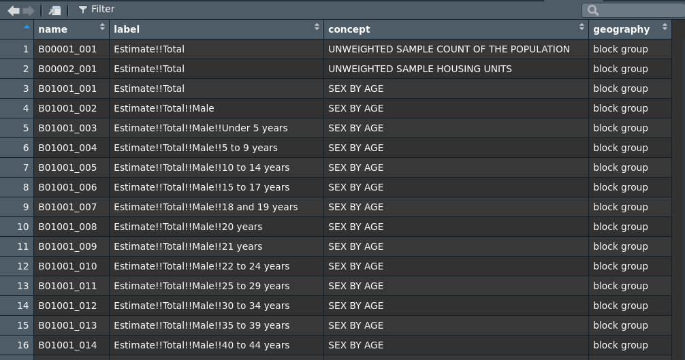
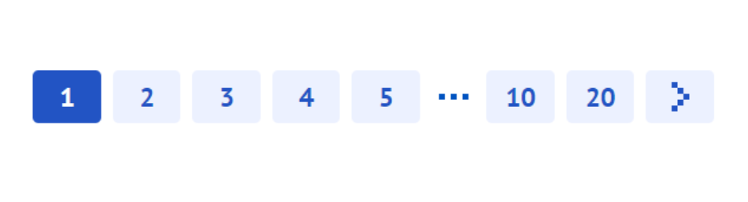
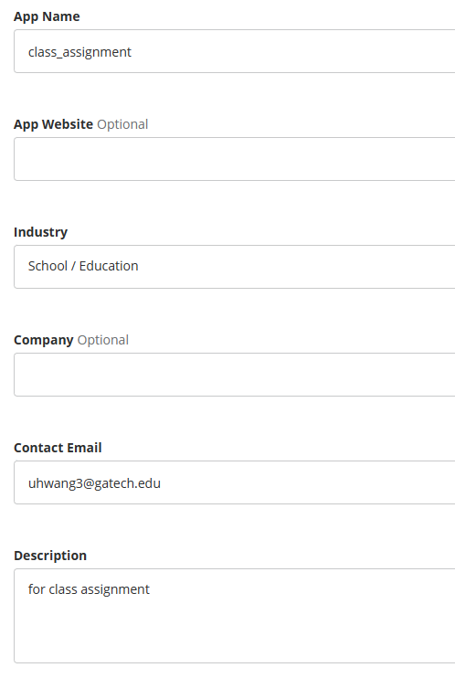
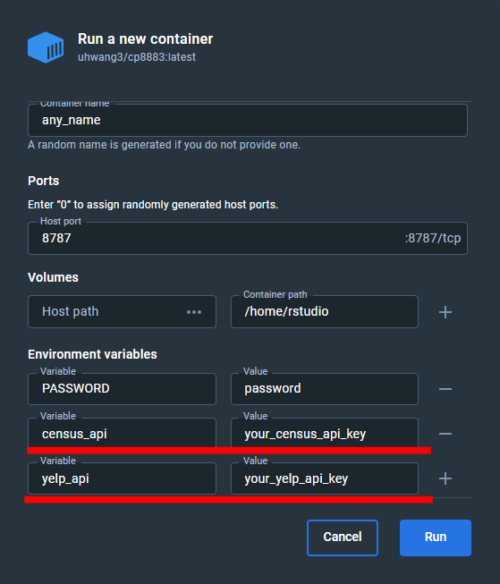
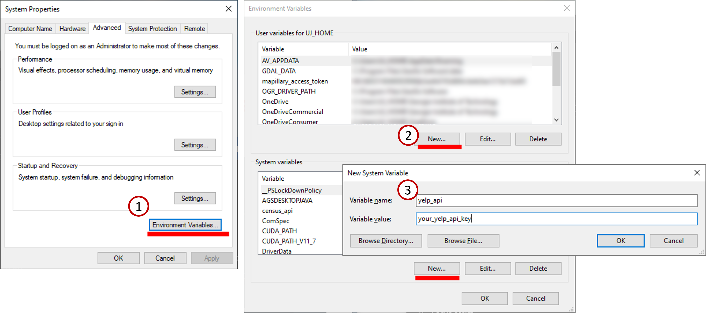

class: middle, inverse

# Accessing data through API

.font100[
Uijeong "UJ" Hwang

9/4/2024
]

```{r xaringan-themer, include=FALSE, warning=FALSE}
library(xaringanthemer)
style_mono_accent(
  base_color = "#1c5253",
  header_font_google = google_font("Open Sans"),
  text_font_google   = google_font("Source Sans Pro", "400", "400i"),
  code_font_google   = google_font("Fira")
)

nice_table <- function(df, height="150px"){
  return(
    df %>% kable() %>% 
      kable_styling(latex_options="scale_down", font_size=12) %>% 
      scroll_box(width = "100%", height = height)
    )
}
```

```{r, include=F}
library(xaringanthemer)
library(sf)
library(tidyverse)
library(leaflet)
library(tmap)
library(kableExtra)
```

---
## Class Module Logistics
* Each module includes:
  - **Rmd**: Hands-on materials.
  - **HTML**: Knitted output from the Rmd file.
  - **Slides**: Prerequisite information for the hands-on materials.
* After covering the slides, you will work on the materials at your own pace.
* You follow the materials in both the Rmd file and HTML document simultaneously.
* You run each r code chunk in the Rmd file and digest what it does/means.
* Ask questions as many as possible!

---
## What is an API?

--
### Application Programming Interface
A mechanism for two computing interfaces (often a client and a server) to talk to each other using a set of definitions and protocols.

--
### Examples:
* Getting data from Census
* Getting data from third parties who give us access (Yelp, Google, etc.)
* Weather information on your phone
* Crime stats from Police Crime Servers
* Others?

---
## How Do APIs Work?
<font size="-1">Let's just look at REST API for simplicity..</font>
.small[
- Request - The client computer sends a request using HTTP method using commands such as GET, PUT, POST, DELETE etc., (GET new data, PUT/POST update/Create, etc.)
- Route - The server maps the request to a specific endpoint, a URL that corresponds to a specific resource or action (one endpoint is usually associated with one resource)
- Process - The server performs the requested action and generates a response
- Response - The server sends the response back to the client. The response includes the information / data that the client was requesting
- Client Processing - the client receiveds the response and processes it (such as formatted for display or input for another application)
]


<!-- --- -->
<!-- ## Content -->
<!-- * Yelp API Key -->
<!-- * Census API Key -->
<!-- * Using Environment Variable -->
<!-- * Tidycensus -->
<!-- * Yelp Business Search and Pagination -->
<!-- * sfg, sfc, and sf -->

---
## Census API Key

* We will be using Census data frequently throughout this course.
* Census data will accessed within R through Census API.
* You need a key, which can be acquired from **[here](https://api.census.gov/data/key_signup.html).**
* Information required: organization name & email address

---
## Tidycensus
* `tidycensus` allows r users to download Census data (via the Census API) in **data frame** or **sf** formats.
* To retrieve Census data using an R script, we need to know the code of the variable we want to access.
  - For example, the code for median household income is B19013.
* One quick way to search for the variable code is by using [National Historical GIS (NHGIS)](https://www.nhgis.org/).
* Another method is to use a function within `tidycensus`.
  - **`tidycensus::load_variables()`** provides a list of variables and their descriptions.

---
## Tidycensus syntax
```{r eval=F}
library(tidycensus)

census_api_key('load your api key here')

census <- get_acs(geography = "county",
                  state = "GA", 
                  county = c("Fulton", "Cobb"),
                  variables = c(med_income = "B19013_001"), 
                  year = 2022,
                  geometry = TRUE)
```

---
## NHGIS data finder
```{r echo=F}
knitr::include_graphics("img/nhgis.JPG")
```

---
## Searching for Variables

```{r eval=F}
vars <- load_variables(2022, "acs5")
View(vars)
```



---
## Yelp API

```{r, out.width = "95%", echo=F}
knitr::include_graphics("img/yelp.png")
```

---
## Yelp Business Search 

* "[Business search] endpoint returns **up to 1000 businesses** based on the provided search criteria." 
  * Search input: (1) a lng/lat coordinate and (2) search radius.
* We need to make sure **each search returns < 1000 results**.
* Atlanta should be broken down to **smaller bits**.
* We will download Yelp data for each **Census Tract** and merge them.

---
## Pagination

* Even if we have less than 1000 results, we cannot get all their information in one API request.
* we can only get **up to 50 business information** per request.
  - If there are 130 results, for example, we need to request 3 times: 1-50, 51-100, and 101-130.
* In the first request, we set **offset=0**. After collecting the first 50 business information, we set **offset=50** in the next request, and so on until we collect all of them.

.center[
```{r, out.width="400px", echo=F}

```
]

---
## Using Tracts to break down the search

.small[
1. Generate a **bounding box** of a given Census Tract.
2. Find the **centroid** of the bounding box.
3. Find the **radius** of search area from the centroid such that *the circle defined by the centroid and radius entirely contains the polygon*.
4. Centroid = lat/lng for Yelp search. Radius = distance.
5. Send API request to Yelp server to get a response.
6. We can repeat this process for all Census Tracts
]

.center[
```{r, out.width = "300px", echo=F}
knitr::include_graphics("img/radius.png")
```
]

---
## Yelp API Key

.pull-left[
.footnotesize[
* Just like Census, we need an API key to make API request to Yelp server. Click **[here](https://fusion.yelp.com/)**.
  1. Sign up.
  2. Then go [here](https://www.yelp.com/developers/v3/manage_app) to Create New App.
  3. Fill out form.
  4. You will get an email from Yelp. Once you confirm, the webpage will refresh and your key will be there.
  5. (You might need to fill out the form again, but will not have to do the email verification).
]]

.pull-right[
```{r, out.width = "400px", echo=F}

```
]

---
## Yelp API is not free


---
## How to manage API keys
* API services are often **not** free.
* Monitor API usage and set up alerts for usage limit or unauthorized access.

* Do not share your API keys in public repositories or forums.
* If someone uses your API key, you will be charged.
* You should protect it.
* Everything on Rpubs is public.
* **DO NOT HARDCODE API KEYS IN YOUR CODE**.
* Instead, use environment variable.

---
## How to set up system environment variable: using Docker
.pull-left[
* Create a new container with api keys as environment variables.
]
.pull-right[

]

---
## How to set up system environment variable: in Windows
.small[
* Press Windows key and search 'edit the system environment variables'.  
  (Or, go to Control panel - System - Advanced system settings - 'Advanced' tab)
* Click 'Environment Variables' and add the environment variables.
]


---
## How to set up system environment variable: in MacOS
.small[
1. Open the terminal.
2. Run `echo $SHELL` and check the path:
  - if the path is `/bin/zsh`, go to 3.1.
  - if the path is `/bin/bash`, go to 3.2.
3. Run one of the following commands to open the file in text editor:
  1. `nano ~/.zshrc`
  2. `nano ~/.bash_profile`
4. Add environment variables by adding the following line(s):  
  `export [variable_name]=[variable_value]`
5. Save and close the file by pressing `Ctrl + o` and then `Ctrl + x`.
6. Run RStudio and see if the system environment variable is working:  
  `Sys.getenv('your_sys_env_var_name')`
]

---
## How to set up system environment variable: R-specific method
.small[
1. Check your home directory.
  - Open RStudio and run `getwd()`. The output is the home directory.
2. Create '.Renviron' file in your home directory.
  - Open a text editor.
  - save a blank file as '.Renviron' in the home directory.
3. Add your environment variables to the file.
  - [variable_name]=[variable_value]
  - e.g., `census_api=your_census_api_key`
4. Restart RStudio and check the variables you added.
  - `Sys.getenv()`
]

---
## Let's get API keys

1. Get Census API key ([link](https://api.census.gov/data/key_signup.html)).
2. Get Yelp Fusion API key ([link](https://fusion.yelp.com)).
3. Add the two API keys in your system environment variable list.

* Test if the environment variables are working in your R Studio session by running:
  * `Sys.getenv("your_sys_env_var_name")`
* If you see both keys fine, you are good to go.


