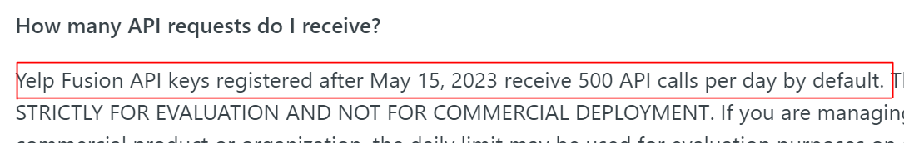

```{r xaringan-themer, include=FALSE, warning=FALSE}
library(xaringanthemer)
style_mono_accent(
  base_color = "#1c5253",
  header_font_google = google_font("Open Sans"),
  text_font_google   = google_font("Source Sans Pro", "400", "400i"),
  code_font_google   = google_font("Fira")
)
```

```{r, include=F}
library(xaringanthemer)
library(sf)
library(tidyverse)
library(leaflet)
library(knitr)
library(kableExtra)
library(tidycensus)
```

## Regarding assignments
* As for the mini assignment 1, you won't be penalized for late submission due to API quota limit issue.

* In the worst case, submit your **Rmd** file.
* Do not expose your API key!
* If you have no option but to put it in Rmd file, use **include=FALSE** option
.large[
````{verbatim}
```{r, include=FALSE}
api_key <- "your_api_key"
```
````
]

