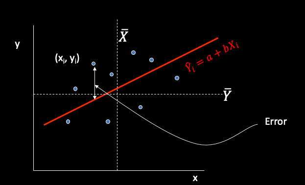

class: inverse, middle

# Exploratory Data Analysis
### Examining your data and understanding their patterns

.font100[
Uijeong "UJ" Hwang

9/18/2024
]

```{r, include=F}
library(tidyverse)
library(xaringanthemer)
library(sf)
library(leaflet)
library(tmap)
library(kableExtra)
library(knitr)
library(skimr)
library(plotly)
tmap_mode("view")

yelp <- read_rds("yelp_census.rds")
yelp$price[is.na(yelp$price)] <- "$$$"

census <- read_rds("census_yelp.rds") %>% 
  drop_na(hhincome) %>% 
  mutate(wfh_pct = round(trans.WfH/trans.total, 3),
         drivealone_pct = round(trans.drovealone/trans.total, 3),
         walk_pct = round(trans.walk/trans.total, 3),
         bicycle_pct = round(trans.bicycle/trans.total, 3),
         transit_pct = round(trans.pubtrans/trans.total, 3),
         white_pct = round(race.white/race.tot, 3))
```


```{r, include=F}
knitr::opts_chunk$set(dpi = 300, fig.width = 10, fig.height = 6)
```

---
## Regarding the final team project
### Conducting original research

* **Conduct a research project that**:
  * Leverages analytical knowledge and skills you learn from this class
  * Follows the principles of academic research
<br><br>
--

* **What is research?**
  * Identifying a question or problem
  * Gathering relevant information
  * Analyzing and interpreting data
  * Drawing conclusions based on evidence

---
## Two important processes in research 

* **Conceptualization: developing and refining abstract ideas or concepts**
  * Identify the concept
  * Review existing literature
  * Develop a working definition
<br><br>
--

* **Operationalization: Translating abstract concepts into something measurable**
  * Identify indicators of the concept
  * Determine how to measure these indicators
  * Develop specific procedures for measurement

---
## Research question

* **Your research question should be:**
  * Specific
  * Original
  * Relevant to urban studies
  * Feasible to answer within the constraints
<br><br>
--

* **Example research questions:**
  * What discourses happen around urban rails-to-trails projects?
  * How do flood events affect street networks & people’s outdoor activity?
  * What elements influence individuals’ perceptions of liveliness in urban areas?
  * How has the COVID-19 pandemic changed urban eating habits?

---
## Schedule

* (10/2) Project Idea and Review of Literature/Examples
  * Focus on **research question and conceptualization**
  * won't be graded
--

* (11/4) Project Data, Methods, & Preliminary Results
  * Focus on **operationalization**
  * won't be graded
--

* (12/2) Final presentation
  * Showcase everything, focusing on your **findings**
  * **<font color="red">graded</font>**
--

* (due 12/6) Deliverable: Web Document
  * **<font color="red">graded</font>**
 
---
class: inverse, middle, center

# Exploratory Data Analysis

---
## Why Exploratory Data Analysis?

--
.small[
* **To examine possible inaccuracies and inconsistencies**
  * Outliers
  * Data falling outside the known parameters (bad data)
  * Incomplete data (NA and illegitimate 0 values)
]
--
.small[
* **To explore trends and variations in the data**
  * Look for central tendencies, frequent values
  * Skewness and non-linearities
  * Spatial variation/distribution
]
--
.small[
* **To explore relationships**
  * How are the variables associated with each other?
  * What are some interesting patterns?
  * What interesting questions can be addressed with the data?
]


---
class: inverse, middle, center

### 1. Examining possible inaccuracies and inconsistencies

---
## Getting summary statistics: summary()

.small[
```{r}
df <- data.frame(numeric_col = c(0,2,2,3,3,3,4,4,4,4,5,5,NA),
                 logical_col = c(T,T,T,T,T,T,F,F,F,F,F,F,NA),
                 character_col = c('A','A','A','B','C','C','C','C','D','D','D',NA,NA),
                 factor_col = as.factor(c('A','A','A','B','C','C','C','C','D','D','D',NA,NA)))

summary(df) %>% print()
```
]

---
## Getting summary statistics: "skimr" package

```{r eval=F}
skimr::skim(df)
```

```{r echo=F, out.width='85%'}

```


---
class: inverse, middle, center

### 2. Exploring trends and variations

---
## Histogram

.small[
.pull-left[
```{r}
hist(census$hhincome, breaks = 100)
```
]

.pull-right[
```{r}
ggplot(census) +
  geom_histogram(aes(x = hhincome), bins = 100)
```
]
]

---
## Density plot
.small[
```{r}
ggplot(yelp) +
  geom_density(aes(x = rating, fill = price), alpha = 0.3)
```
]

---
## Spatial autocorrelation

.small[
* Tobler's first law of geography:

> Everything is related to everything else, but near things are more related than distant things.

* Tobler also said:

> The phenomenon external to an area of interest affects what goes on inside.


]

---
## Race and ethnicity map

[](https://www.cnn.com/interactive/2021/us/census-race-ethnicity-map/)


---
class: inverse, middle, center

### 3. Exploring associations

---
## Scatterplot
.small[
* Plotting data is a useful way to look for associations
* Association between **household income** and **the number of commuters by SOV**:
]
```{r echo=F, out.width = '80%'}
knitr::include_graphics("img/plot_drovealone1.png")
```

> Any problem with this plot?

---
## Scatterplot

* Redoing the plot with **the PROPORTION of commuters by SOV**

```{r echo=F, out.width = '90%'}
knitr::include_graphics("img/plot_drovealone2.png")
```

---
## 3D scatterplot

.small[
* Associations between household income, telework, and SOV
]

```{r echo=F, out.width = "100%", out.height="80%"}
plot_ly(census, x = ~hhincome, y = ~wfh_pct, z = ~drivealone_pct,
        type = "scatter3d", mode = "markers",
        marker = list(symbol = 'circle', sizemode = 'diameter')) %>%
  layout(scene = list(xaxis = list(title = 'Household income'),
                      yaxis = list(title = 'Work from home'),
                      zaxis = list(title = 'Drive alone')))

```

---
## 3D scatterplot
.small[
* Associations between household income, telework, SOV, and White population
]
```{r echo=F, out.width = "100%", out.height="80%"}
plot_ly(census, x = ~hhincome, y = ~wfh_pct, z = ~drivealone_pct, color = ~white_pct,
        type = "scatter3d", mode = "markers",
        marker = list(symbol = 'circle', 
                      sizemode = 'diameter',
                      colorbar = list(title = "Bicycle %"),  # Add a colorbar title
                      colorscale = 'Viridis')) %>%
  layout(scene = list(xaxis = list(title = 'Household income'),
                      yaxis = list(title = 'Work from home'),
                      zaxis = list(title = 'Drive alone')))
```

---
## Correlation coefficient

.small[
* Measures the linear association between two variables.
  * -1: Perfectly negative linear correlation between two variables.
  * 0: No linear correlation between two variables.
  * 1: Perfectly positive linear correlation between two variables.

```{r}
cor(census$hhincome, census$trans.drovealone) %>% print()
```
```{r}
cor.test(census$hhincome, census$trans.drovealone) %>% print()
```
]

---
## Linear Regression

* Regression analysis allows us to measure the relationship between a continuous, dependent variable and one or more independent variables

.pull-left[
* We can think of this relationship as the line that best fits a series of data points on an X-Y axis

* The best fitting line is the line that minimizes the "error" between predicted y and actual y
]
.pull-right[
```{r out.width = '100%', echo=F}

```
]

---
## Linear Regression
.small[
* The linear relationship between proportion of people who work from home and household income (Which variable should be dependent?)
```{r, out.width ="200px", out.height="200px"}
regress_wfh <- lm(wfh_pct ~ hhincome, data = census)
summary(regress_wfh)
```
]

---
class: inverse, middle, center

### If you observe relationships between two or more variables, be careful NOT to assume cause and effect!

# "Correlation does not imply Causation!"


---
## Plot the regression line
.small[
```{r, out.width ="400px", out.height="400px"}
plot (census$hhincome, census$wfh_pct, main = "The relationship between telework and income", xlab="Household Income", ylab="Percent working from home")

abline(lm(wfh_pct ~ hhincome, data=census), col="red", lwd = 3)
```
]


