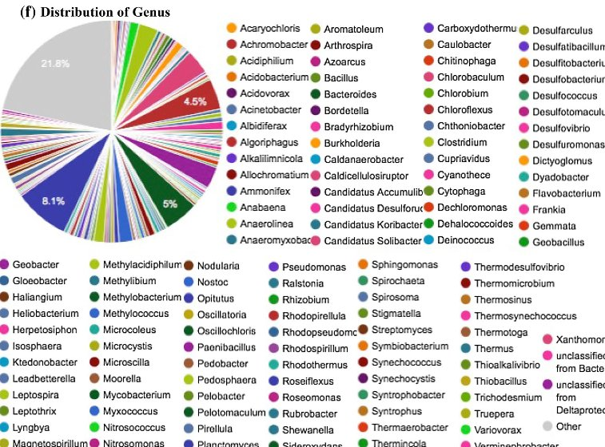
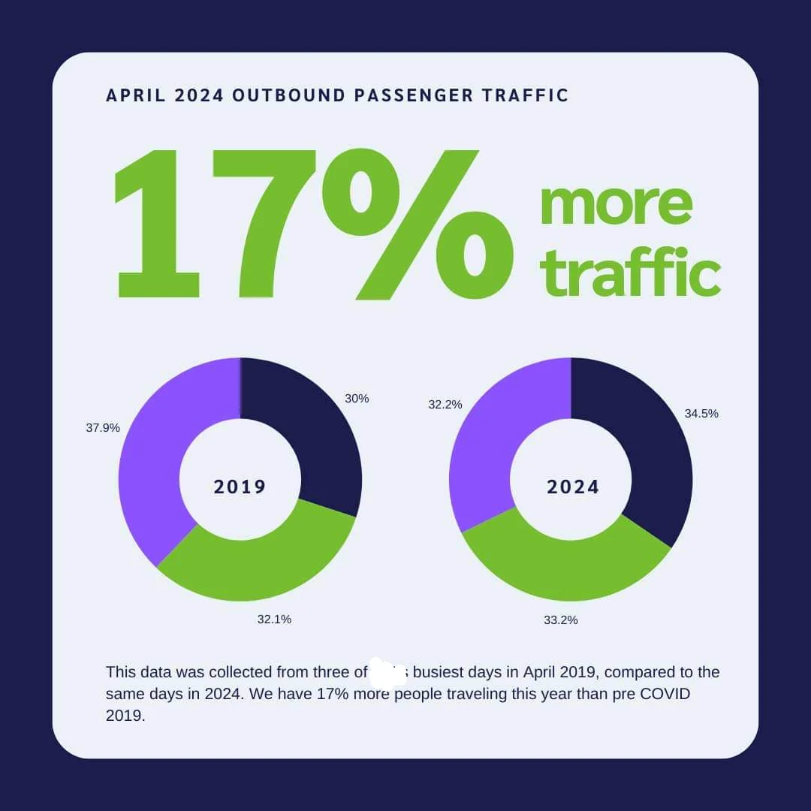
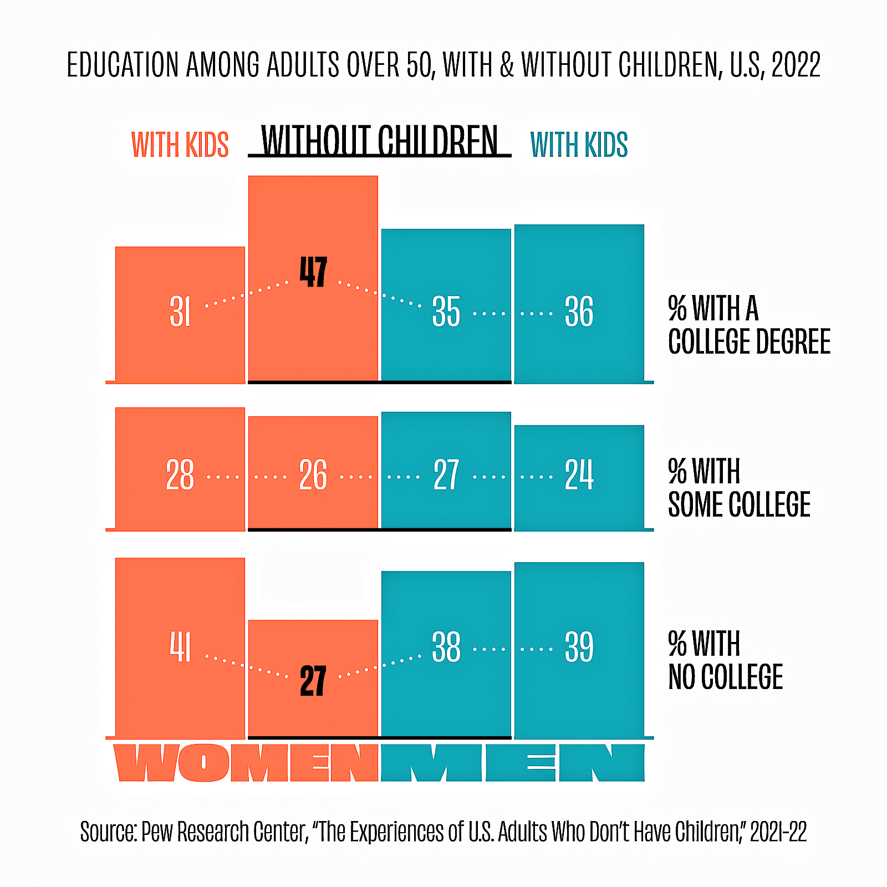

class: inverse, middle

# `r rmarkdown::metadata$title`

.font100[
`r rmarkdown::metadata$author`

`r rmarkdown::metadata$date`
]

```{r setup, include = FALSE}
library(knitr)
library(tidyverse)
library(skimr)
library(tmap)
tmap_mode("view")
# set default options
opts_chunk$set(echo = FALSE,
               fig.align='center',
               dpi = 300)

```


---

```{r echo=F, out.height='600px', out.width='auto'}
knitr::include_graphics("img/john_snow_cholera_map.jpg")
```


---
## Storytelling is the Essential Art & Skill for Data Analysts
.small[
* Stories are powerful means of communication:
  * Storytelling is an integral part of humanity
  * Storytelling is more memorable and persuasive than just facts
  * Stories define the issues and provide a means to make subtle but powerful arguments
]


---
class: inverse, middle, center

### "It is the *meaningfulness* of the answers given, rather than their factual *truthfulness*, that gives them their credibility. The hearers of the story believed that it was true because it was meaningful, rather than it was meaningful because it was true." (Parry & Doan, 1994)


---

```{r echo=F, out.height='600px', out.width='auto'}
knitr::include_graphics("img/improper_scaling.png")
```

---

```{r echo=F, out.height='600px', out.width='auto'}

```


---

```{r echo=F, out.height='600px', out.width='auto'}

```

---

```{r echo=F, out.height='600px', out.width='auto'}

```

---
```{r echo=F, out.height='600px', out.width='auto'}

```

---
```{r echo=F, out.height='600px', out.width='auto'}

```

---
```{r echo=F, out.height='600px', out.width='auto'}

```

---
```{r echo=F, out.height='600px', out.width='auto'}

```

---
```{r echo=F, out.height='600px', out.width='auto'}

```

---
```{r echo=F, out.height='600px', out.width='auto'}

```

---
```{r echo=F, out.height='600px', out.width='auto'}

```

---
```{r echo=F, out.height='600px', out.width='auto'}

```

---
```{r echo=F, out.height='600px', out.width='auto'}

```

---
```{r echo=F, out.height='600px', out.width='auto'}

```

---
```{r echo=F, out.height='600px', out.width='auto'}
knitr::include_graphics("img/unnecessary_3d.png")
```

---
```{r echo=F, out.height='600px', out.width='auto'}
knitr::include_graphics("img/unnecessary_3d_2.jpg")
```

---
```{r echo=F, out.height='600px', out.width='auto'}

```

---
```{r echo=F, out.height='600px', out.width='auto'}

```

---
```{r echo=F, out.height='600px', out.width='auto'}

```

---
```{r echo=F, out.height='600px', out.width='auto'}

```

---
```{r echo=F, out.height='600px', out.width='auto'}

```

---
```{r echo=F, out.height='600px', out.width='auto'}

```

---
```{r echo=F, out.height='600px', out.width='auto'}
knitr::include_graphics("img/use_of_color_6.png")
```

---
```{r echo=F, out.height='600px', out.width='auto'}

```

---
```{r echo=F, out.height='600px', out.width='auto'}
knitr::include_graphics("img/use_of_color_8.png")
```

---
```{r echo=F, out.height='600px', out.width='auto'}

```

---
```{r echo=F, out.height='600px', out.width='auto'}

```

---
```{r echo=F, out.height='600px', out.width='auto'}
knitr::include_graphics("img/map_with_tmi_1.png")
```

---
```{r echo=F, out.height='600px', out.width='auto'}

```

---
```{r echo=F, out.height='600px', out.width='auto'}

```

---
```{r echo=F, out.height='600px', out.width='auto'}

```


---
## Key Elements of Visual Storytelling

* Context and framing
* Color theory and use
* Typography and labeling
* Composition and layout
* Interactivity (if applicable)


---
## More Examples of Good/Bad Visualizations

Good examples using R
  * [R Graph Gallary](https://r-graph-gallery.com/)
  * [Cédric Scherer](https://www.cedricscherer.com/top/dataviz/)
  * [Georgios Karamanis](https://karaman.is/)

Good examples
  * [Stock Treemap](https://finviz.com/map.ashx)
  * [VisualCinnamon](https://nbremer.github.io/Chord-Diagram-Storytelling/)

Bad examples
  * [r/dataisugly](https://www.reddit.com/r/dataisugly/)


