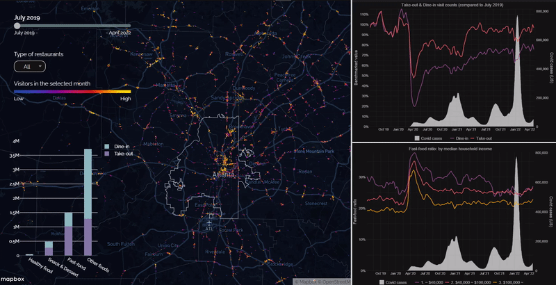

```{r setup, include = FALSE}
library(knitr)
library(tidyverse)
library(gt)
library(kableExtra)
# set default options
opts_chunk$set(echo = FALSE,
               fig.width = 10.252,
               fig.height = 10,
               dpi = 300)

# uncomment the following lines if you want to use the NHS-R theme colours by default
# scale_fill_continuous <- partial(scale_fill_nhs, discrete = FALSE)
# scale_fill_discrete <- partial(scale_fill_nhs, discrete = TRUE)
# scale_colour_continuous <- partial(scale_colour_nhs, discrete = FALSE)
# scale_colour_discrete <- partial(scale_colour_nhs, discrete = TRUE)
```

class: title-slide, left, bottom

# `r rmarkdown::metadata$title`
----
### `r rmarkdown::metadata$author`
### `r rmarkdown::metadata$date`

---
class: inverse, middle, center

## This is one of two required courses to complete 
###(other than the Capstone)
# the Master of Science in Urban Analytics degree

---
# Instructors for this class

.left-column[
```{r, include=F, out.height='100%'}
knitr::include_graphics("https://airmobility.gatech.edu/files/2019/06/Subhro-Guhathakurta-300x300.jpg")
```
# 
```{r, include=F, out.height='70%'}
knitr::include_graphics("https://ujhwang.github.io/images/IDphoto_Hwang.jpg")
```
# 
]
.right-column[
<b>Dr. Subhro Guhathakurta</b> joined Georgia Tech in 2011 as the director of the Center for Geographic Information Systems, which he re-branded in 2016 to be the Center for Spatial Planning Analytics and Visualization. He is the former chair of the School of City and Regional Planning, where he is also a professor. Dr. Guhathakurta is the Program Director of Master of Science in Urban Analytics.

<br>
<b>Dr. Uijeong "UJ" Hwang</b> is a senior transportation planner in Performance Analysis and Monitoring team at Atlanta Regional Commission. His research interests center around travel behaviors and choices, particularly the factors that make people choose more walking, biking, and public transit. He received PhD in City and Regional Planning and MS in Urban Analytics at Georgia Tech.
]


---
#Class Introductions
###We would like to know
* Your name
* Where you are from (hometown)
* Degree program
* Training (undergraduate degree, other degrees)
* Fun fact(s) about you

---

# What is Urban Analytics?

--

###Application of <b>Big data</b> and <b>data science tools</b> to understand, monitor, and control urban functions and processes

--

###Michael Goodchild defines it as a 'new kind of urban research, one that exploits the vast new sources that are becoming available from social media, crowd sourcing, and sensor networks...'

--

###'Urban analytics is fast emerging as the core set of tools employed to deal with problems of big data, urban simulation, and geodemographics' -- Michael Batty

--

##Analytics is the discovery, interpretation, and communication of meaningful patterns in data' --Wikipedia


---
#The Plan for the Course

##The course is divided into Six Modules

<table style="font-size: 22px; width: 80%; margin: auto;">
  <tr>
    <th style="text-align: left;">Module</th>
    <th style="text-align: left;">Topic</th>
  </tr>
  <tr>
    <td>Module 0:<br>Preparation</td>
    <td>
      <ul>
        <li>Intro to R</li>
        <li>Docker setup</li>
      </ul>
    </td>
  </tr>
  <tr>
    <td>Module 1:<br>POI & Census</td>
    <td>
      <ul>
        <li>Using APIs to collect data</li>
        <li>Data wrangling and tidying</li>
      </ul>
    </td>
  </tr>
  <tr>
    <td>Module 2:<br>Graphic communication & <br>storytelling</td>
    <td>
      <ul>
        <li>Interactive visualization</li>
        <li>Telling stories with data / analysis</li>
      </ul>
    </td>
  </tr>
</table>

---
#The Plan for the Course

##The course is divided into Six Modules

<table style="font-size: 22px; width: 80%; margin: auto;">
  <tr>
    <th style="text-align: left;">Module</th>
    <th style="text-align: left;">Topic</th>
  </tr>
  <tr>
    <td>Module 3:<br>Transportation</td>
    <td>
      <ul>
        <li>Using General Transit Feed Specification (GTFS)</li>
        <li>Network analysis with OpenStreetMap</li>
      </ul>
    </td>
  </tr>
  <tr>
    <td>Module 4:<br>Urban image & <br>computer vision</td>
    <td>
      <ul>
        <li>Sampling and processing street view images</li>
        <li>Using Computer Vision to extract information from images</li>
      </ul>
    </td>
  </tr>
  <tr>
    <td>Module 5:<br>Social media</td>
    <td>
      <ul>
        <li>Collecting and processing text data from Reddit</li>
        <li>Sentiment analysis</li>
      </ul>
    </td>
  </tr>
  <tr>
    <td>Module 6:<br>Data ethics</td>
    <td>
      <ul>
        <li>Data ethics and privacy</li>
      </ul>
    </td>
  </tr>
</table>

---
# Deliverables and Grading Breakdown
* Only four out of the five mini assignments will be counted towards the final grade. 
* The team project presentation is based on PowerPoint slides (or other presentation tool of your choice.) 
* The team project report should be a web document rendered from R Markdown (or other tool of your choice).

```{r echo=F}
data.frame('Assignment Type' = c('Mini Assignments (4 out of 5)', 
                                 'Major Assignments (3 out of 3)', 
                                 "Team Project Presentation & Report",
                                 "Participation"),
           'Percent' = c("20% (5% each x 4)", 
                         "45% (15% each x 3)", 
                         "30%",
                         "5%")) %>% 
  kbl() %>% 
  kable_styling(bootstrap_options = c("condensed", "responsive"))

```

---
#Examples of Previous Class Project

* [Evaluating Transit Accessibility to Affordable Grocery](https://rpubs.com/sli956/CP8883FinalReport4)
* [Tracking Urban Rails-to-trails Discourse on Reddit](https://mohsinyousufi.github.io/cp8883report/)
* [How Do Flood Events Affect Street Networks & Outdoor Activity?](https://rpubs.com/ppatty666/uaprojectfinalv3)
* [Predictive Modeling of the Perception of Liveliness in Atlanta Using Place Pulse and Google Street View Data](https://rpubs.com/runner157/1124596)

---
#Example of MSUA Capstone: Covid-19 & eating habit
<a href="https://ujhwang.github.io/covid-19-eating-habit"></a>


---
#Course Logistics

###Platform
* R Studio (almost entirely)
* A Docker image will be shared

###Communication
* Canvas
* Discussion Board on Canvas
* emails (mostly through CANVAS)

### Each module consists of
* 1 or 2 lecture sessions
* 2 lab sessions

---
# Course Logistics

### Readings
* Available via links in the syllabus

### Assignments
* Render RMarkdown script into a web document and deploy (or publish) it to RPubs
* Submit the URL to the web document

### Class presentations 
* Three student presentations (by groups) for final project milestones
* How do you want to form the groups?

## Any questions?


